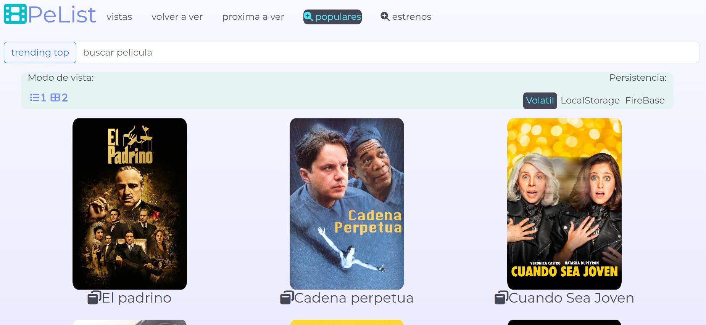

# Pelist
Pelist es una aplicación web desarrollada como proyecto final del curso de front-end + React.js de https://lumetrio.com/bootcamp para aprender los conceptos básicos de React, html, bootstrap, css y firebase  utilizando create react app para inicializar el proyecto. Pelist es una aplicación para crear listados de psliculas en 3 categorias (vistos, volver a ver y proximo a ver). Las listas creadas por el usuario se pueden guardar sin persistencia de la informacion o con persistencia en el Local Storage o en FireBase-FireStore . 

Pelist está alojado en Firebase y se puede acceder a él a través de la siguiente URL: https://pelistadora-6ec55.web.app/

